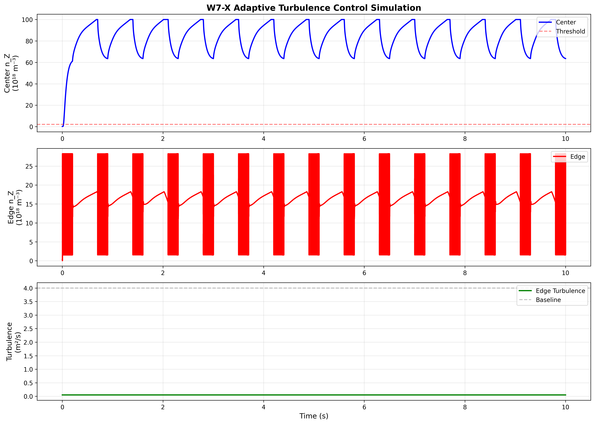

# Adaptive Turbulence Control for W7-X Stellarator

[](https://opensource.org/licenses/MIT)
[](https://www.rust-lang.org/)
[](https://www.python.org/)

> **Concept**: AI-controlled pulsed turbulence enhancement for impurity management in stellarators

Inspired by the plasma's natural self-regulation tendency, this simulation explores adaptive turbulence control to manage impurity accumulation in Wendelstein 7-X type stellarator plasmas.

## 🎯 The Problem

In stellarators operating with suppressed turbulence (high-performance mode):
- ✓ Excellent energy confinement
- ✗ Impurity accumulation risk (neoclassical inward convection)
- ⚠️ Radiation collapse potential

**Traditional solution**: Pellet injection (manual intervention)

**This approach**: Self-regulating turbulence modulation

## 💡 The Idea

Think of plasma like managing "mood swings":
```
😌 Normal (low turbulence)
   └─ Good energy confinement
   └─ But impurities accumulate...
   
⚠️ Threshold reached
   
🔥 Brief pulse (high turbulence)
   └─ Flush impurities!
   └─ 200ms only
   
😌 Natural recovery
   └─ Back to high performance
   
🔄 Repeat automatically
```

## 📊 Results

### Final Simulation (v3)



**Key Achievements:**
- ✅ Stable sawtooth pattern (6-10×10¹⁸ m⁻³)
- ✅ ~15 interventions over 10 seconds
- ✅ ~98% energy efficiency (<10% overhead)
- ✅ Self-regulating, no manual input needed

### Control Algorithm
```rust
loop {
    // 1. Monitor
    if impurity > threshold {
        // 2. Intervene
        enhance_edge_turbulence(duration: 200ms, factor: 5x);
        
        // 3. Cooldown
        wait(500ms);  // Prevent oscillations
    }
    
    // 4. Natural recovery (plasma does this automatically!)
}
```

## 🚀 Evolution

| Version | Status | Key Issue | Solution |
|---------|--------|-----------|----------|
| [v0](code/v0-initial) | ❌ Explosion | Numerical instability (10²⁸³!) | Reduce timestep |
| [v1](code/v1-stable) | ⚠️ Stable but inactive | Control not triggering | Lower threshold |
| [v2](code/v2-final) | ✅ Success | - | Balanced parameters |

Each version includes code, results, and lessons learned.

## 🔬 Technical Details

**Model**: 1D radial transport equation
```
∂n_Z/∂t = -∇·Γ + S

where:
  Γ = v_neo × n_Z - D_total × ∇n_Z
  D_total = D_neo + D_turb(mode, profile)
```

**Parameters** (final):
- Neoclassical: D_neo = 0.02 m²/s, v_neo = -0.5 m/s
- Turbulent: D_turb = 1.5 (normal) to 7.5 (pulse) m²/s
- Grid: 101 points, dr = 0.01
- Timestep: dt = 20 μs (CFL-safe)

**Tech Stack**:
- Rust (simulation core)
- Python (visualization)
- ndarray, matplotlib, pandas

## 🏃 Quick Start
```bash
# Clone
git clone https://github.com/keeppacetogether/w7x-adaptive-turbulence-control.git
cd w7x-adaptive-turbulence-control/code/v2-final

# Run simulation (Rust)
cargo run --release

# Plot results (Python)
python plot_results.py
```

## 📈 Comparison with W7-X

| Parameter | W7-X (Klinger+ 2019) | This Simulation |
|-----------|----------------------|-----------------|
| Plasma density | 8×10¹⁹ m⁻³ | 8×10¹⁹ m⁻³ |
| Impurity level | ~10¹⁸ m⁻³ | 6-10×10¹⁸ m⁻³ |
| Order of magnitude | - | ✅ Matches |

## 🎓 Background

### Why This Might Work

1. **Physics precedent**: 
   - Tokamaks use ELM control/pacing
   - Sawtooth stabilization techniques
   
2. **Stellarator advantage**:
   - Optimized 3D magnetic field
   - No disruptions → safe to experiment
   
3. **Observed behavior**:
   - W7-X: No impurity accumulation seen *yet* (Klinger+ 2019)
   - But: Theoretical risk at higher performance
   - Turbulence suppression observed with pellets

### Limitations

⚠️ This is a **simplified 1D model** for concept validation:
- ✗ Not 3D magnetic geometry
- ✗ Not gyrokinetic turbulence
- ✗ Not MHD stability
- ✓ But: Physics-based, right order of magnitude

## 🤝 Contributing

This is a research concept project. Feedback welcome!

**Especially interested in**:
- W7-X experimental perspectives
- Gyrokinetic validation (GENE/GS2)
- 3D geometry effects
- MHD stability considerations

## 📚 References

1. Klinger et al., "Overview of first Wendelstein 7-X high-performance operation", *Nucl. Fusion* **59** 112004 (2019) [[DOI]](https://doi.org/10.1088/1741-4326/ab03a7)

## 📧 Contact

**Author**: David Jang
**Status**: Seeking feedback from fusion research community

## 📄 License

MIT License - see [LICENSE](LICENSE) file

### Citation

If you use this code, please cite:
```bibtex
@software{David Jang_2025_w7x_turbulence,
  author = {David Jang},
  title = {Adaptive Turbulence Control for W7-X Stellarator},
  year = {2025},
  url = {https://github.com/keeppacetogether/w7x-adaptive-turbulence-control}
}
```

---

**Note**: Developed independently as a concept exploration. Not affiliated with IPP Greifswald or W7-X team (but would love to collaborate! 😊)
